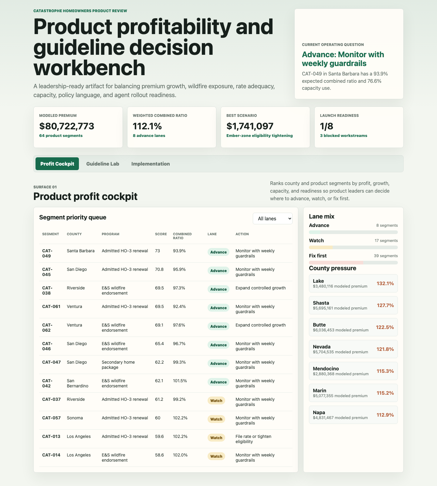
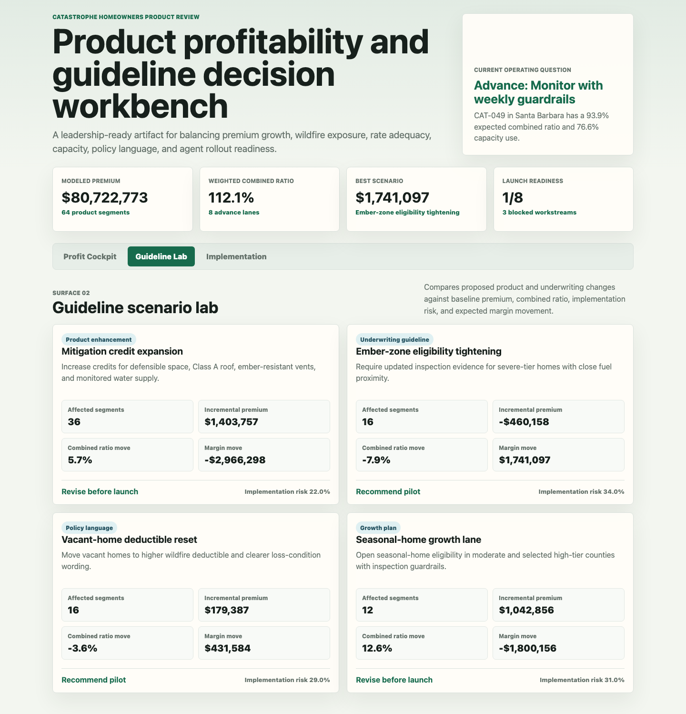
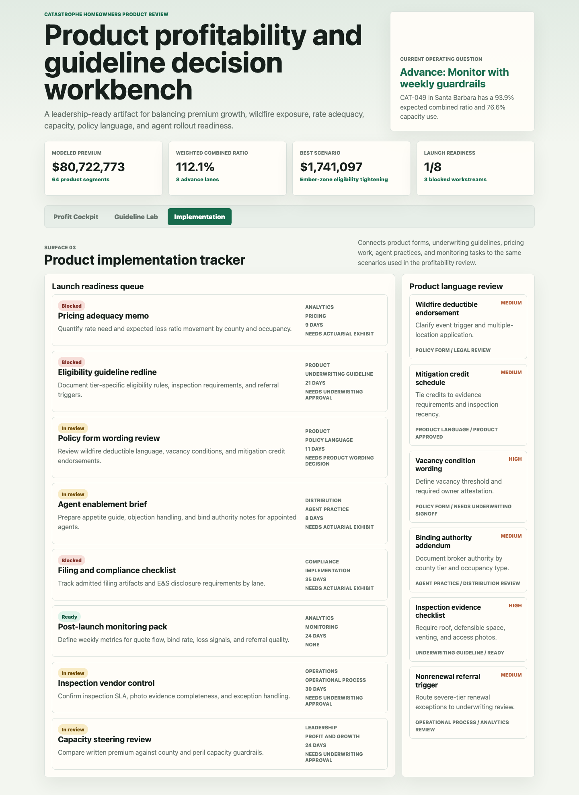

# Catastrophe Homeowners Product Profitability Workbench

This project is a product analyst workbench for a catastrophe-exposed homeowners insurance program. It helps leadership decide which county and product segments should grow, which should be watched with guardrails, and which need rate, underwriting, policy language, or agent-practice work before expansion.

The artifact is intentionally built as more than a dashboard. It combines a profitability queue, guideline scenario modeling, and product implementation tracking so the analysis connects to actual product change decisions.

## Screenshots



**Product profit cockpit:** ranks homeowners product segments by priority score, expected combined ratio, capacity use, agent readiness, and recommended action.



**Guideline scenario lab:** compares product and underwriting changes such as mitigation-credit expansion, eligibility tightening, deductible resets, and seasonal-home growth lanes.



**Product implementation tracker:** ties policy form, underwriting guideline, pricing, agent enablement, compliance, and monitoring workstreams to the scenarios they support.

## What This Demonstrates

- Product profitability analysis for catastrophe-exposed homeowners insurance.
- Explainable product and underwriting scenario modeling.
- Monitoring logic for profit and growth plan execution.
- Product-language and underwriting-guideline implementation thinking.
- Translation of analysis into leadership-ready recommendations.

## Data

The data is synthetic and labeled as synthetic. It does not represent any carrier, MGA, reinsurer, agency, or policyholder book.

The synthetic structure is modeled on common catastrophe homeowners product-management concepts:

- County and region level exposure.
- Wildfire risk tiers: Moderate, High, and Severe.
- Product programs: admitted HO-3 renewal, E&S wildfire endorsement, secondary home package, and vacant home restricted form.
- Occupancy types: primary, secondary, and vacant.
- Product economics: annual premium, technical premium, attritional loss ratio, catastrophe loss ratio, reinsurance load, expense ratio, commission ratio, expected combined ratio, and margin.
- Operating constraints: capacity limits, capacity use, mitigation credit, agent count, agent readiness, filing status, guideline state, and owner.

Generation assumptions are documented in `analysis/methodology.md` and encoded in `scripts/score_operating_data.py`. Expected loss ratios are driven by wildfire tier, occupancy, product lane, and mitigation credit. Premium is generated from total insured value, product relativities, wildfire relativities, occupancy relativities, and mitigation credits. Scenario outputs apply explicit deltas to premium, loss, growth, capacity, and implementation risk.

## Analysis Outputs

- `analysis/outputs/segment_profitability_queue.csv`: ranked product segment queue.
- `analysis/outputs/guideline_scenario_summary.csv`: baseline versus proposed scenario results.
- `analysis/outputs/implementation_readiness_queue.csv`: launch workstreams, owners, blockers, and readiness.
- `analysis/outputs/product_language_review.csv`: product language and guideline review items.
- `analysis/outputs/summary.json`: metrics used by the static workbench.
- `analysis/sql_checks.sql`: SQL checks for portfolio review, scenario review, and launch blockers.

## Scope

This workbench is a portfolio artifact, not a production actuarial model. It does not price individual homes, produce filed rates, replace underwriting judgment, or claim to represent real company results. It is designed to show how a product analyst can structure profitability, growth, underwriting guideline, policy language, and implementation decisions in a catastrophe-exposed homeowners context.

## Run Locally

```bash
npm run analyze
npm run start
```

Then open `http://localhost:4173`.
